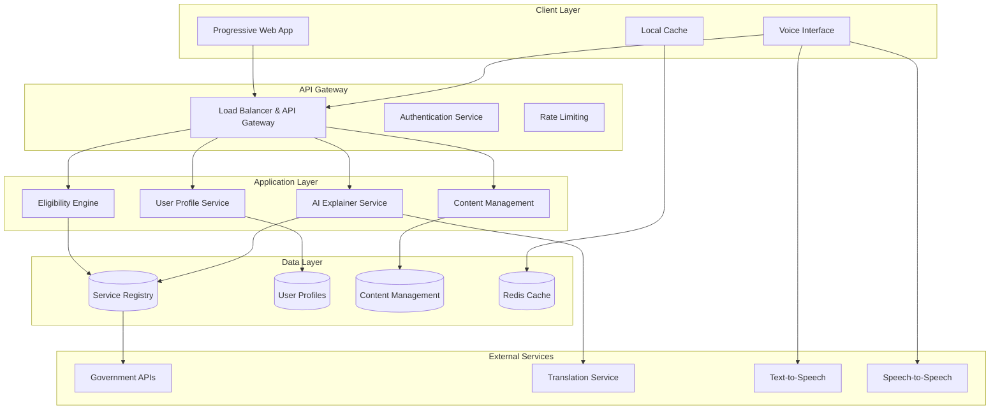

# Design Document: Civic Assistant

## Overview

The Civic Assistant is a web-based, AI-powered platform designed to democratize access to government services and civic information. The system employs a hybrid architecture that combines rule-based eligibility determination with AI-powered natural language processing to provide accurate, trustworthy, and accessible guidance to citizens.

The platform addresses critical accessibility challenges through a mobile-first, progressive web application that operates effectively on low-bandwidth connections and supports multiple languages. By separating decision-making logic (rule-based) from explanation generation (AI-powered), the system maintains accuracy and trust while providing user-friendly interactions.

## Architecture

### High-Level Architecture



### Component Architecture

The system follows a microservices architecture with clear separation of concerns:

1. **Frontend Layer**: Progressive Web Application with offline capabilities and universal browser compatibility
2. **API Gateway**: Centralized routing, authentication, and rate limiting
3. **Core Services**: Domain-specific microservices for business logic
4. **Data Layer**: Distributed databases optimized for different data types
5. **External Integrations**: Government APIs and third-party services

**Design Rationale**: The PWA approach ensures universal accessibility across devices and browsers without requiring app store installations, reducing barriers to access for all citizens regardless of their technical capabilities or device constraints.

## Components and Interfaces

### Frontend Components

#### Progressive Web Application (PWA)
- **Technology**: React/Vue.js with service workers for offline functionality
- **Responsive Design**: Mobile-first approach with progressive enhancement
- **Accessibility**: WCAG 2.1 AA compliant with screen reader support
- **Performance**: Lazy loading, code splitting, and aggressive caching
- **Browser Compatibility**: Works on any web browser without app installation (Requirement 1.4)

**Key Features**:
- Offline mode with cached essential services (Requirement 4.5)
- Progressive loading with skeleton screens (Requirement 4.4)
- Adaptive UI based on connection speed (Requirement 4.1)
- Voice interface integration (Requirement 3.3, 3.4)
- Multi-language support with RTL text support (Requirement 3.1, 3.2)
- Immediate access without mandatory registration (Requirement 1.1)
- 3-second load time on 2G connections (Requirement 1.5)
- Adjustable text size and interface scaling (Requirement 7.5)
- High contrast colors and readable fonts (Requirement 7.4)
- Keyboard navigation support (Requirement 7.3)

#### Voice Interface Component
- **Speech-to-Text**: Web Speech API with fallback to cloud services
- **Text-to-Speech**: Browser native TTS with cloud backup
- **Language Support**: Configurable for 5+ regional languages and dialects (Requirement 3.1)
- **Accessibility**: Voice navigation for visually impaired users (Requirement 7.1)
- **Accuracy**: Speech processing accuracy optimization for selected languages (Requirement 3.3)
- **Output Options**: Both text and optional audio output in user's language (Requirement 3.4)
- **Terminology Consistency**: Maintains consistent terminology across voice and text interfaces (Requirement 3.5)

### Backend Services

#### Authentication and Access Control Service
**Purpose**: Manages user access without mandatory registration while providing optional profile creation for personalization.

**Interface**:
```typescript
interface AuthenticationService {
  createAnonymousSession(): Promise<SessionToken>;
  
  createOptionalProfile(
    sessionToken: SessionToken,
    profileData: Partial<UserProfile>,
    consent: ConsentPreferences
  ): Promise<UserProfile>;
  
  validateAdminAccess(
    credentials: AdminCredentials
  ): Promise<AdminSession>;
  
  revokeSession(sessionToken: SessionToken): Promise<void>;
}

interface SessionToken {
  id: string;
  type: 'anonymous' | 'registered';
  expiresAt: Date;
  permissions: Permission[];
}
```

**Design Rationale**: This service enables immediate platform access without barriers while supporting optional personalization. Anonymous sessions allow users to explore services immediately, while optional registration enables personalized recommendations for users who choose to provide information.

**Features**:
- Immediate anonymous access without registration barriers (Requirement 1.1)
- Optional profile creation with minimal essential data collection (Requirement 1.2)
- Secure session management with appropriate expiration policies
- Administrative access controls for content management (Requirement 10.2)
- Privacy-first design with explicit consent mechanisms (Requirement 9.1)

#### Content Management Service
**Purpose**: Provides administrative interface for content updates and manages content lifecycle.

**Interface**:
```typescript
interface ContentManagementService {
  createContent(
    content: ServiceContent,
    authorId: string
  ): Promise<ContentVersion>;
  
  updateContent(
    contentId: string,
    updates: Partial<ServiceContent>,
    authorId: string
  ): Promise<ContentVersion>;
  
  publishContent(
    contentId: string,
    publisherId: string
  ): Promise<PublishResult>;
  
  validateContent(content: ServiceContent): Promise<ValidationResult>;
  
  getContentHistory(contentId: string): Promise<ContentVersion[]>;
  
  refreshAffectedRecommendations(serviceId: string): Promise<void>;
}

interface ContentVersion {
  id: string;
  contentId: string;
  version: number;
  content: ServiceContent;
  status: 'draft' | 'review' | 'published' | 'archived';
  createdBy: string;
  createdAt: Date;
  publishedAt?: Date;
  validationResults: ValidationResult;
}

interface ValidationResult {
  isValid: boolean;
  accuracyScore: number;
  sourceVerification: boolean;
  errors: ValidationError[];
  warnings: ValidationWarning[];
}
```

**Features**:
- Immediate content updates with live publishing (Requirement 10.1)
- Administrative interface for authorized users (Requirement 10.2)
- Automatic refresh of affected recommendations (Requirement 10.3)
- Version history maintenance (Requirement 10.4)
- Content accuracy validation before publication (Requirement 10.5)

#### Eligibility Engine
**Purpose**: Determines user eligibility for government schemes and services using rule-based logic with comprehensive alternative suggestions.

**Interface**:
```typescript
interface EligibilityEngine {
  evaluateEligibility(
    userProfile: UserProfile,
    serviceId: string
  ): Promise<EligibilityResult>;
  
  getBulkEligibility(
    userProfile: UserProfile,
    categories?: string[]
  ): Promise<EligibilityResult[]>;
  
  getRequirements(serviceId: string): Promise<ServiceRequirements>;
  
  findAlternatives(
    userProfile: UserProfile,
    rejectedServiceId: string
  ): Promise<AlternativeService[]>;
  
  explainIneligibility(
    userProfile: UserProfile,
    serviceId: string
  ): Promise<IneligibilityExplanation>;
}

interface EligibilityResult {
  serviceId: string;
  eligible: boolean;
  confidence: number;
  missingRequirements: string[];
  alternativeServices: string[];
  lastUpdated: Date;
  relevanceRanking: number;
  benefitPotential: 'high' | 'medium' | 'low';
}

interface AlternativeService {
  serviceId: string;
  name: string;
  eligibilityGap: string[];
  benefitComparison: string;
  applicationComplexity: 'simple' | 'moderate' | 'complex';
}

interface IneligibilityExplanation {
  primaryReasons: string[];
  actionableSteps: string[];
  timelineToEligibility: string;
  alternativeOptions: AlternativeService[];
}
```

**Implementation**:
- Rule engine using configurable business rules
- Caching layer for frequently accessed eligibility checks
- Audit logging for all eligibility determinations
- Integration with government databases for real-time data
- Relevance ranking and benefit potential assessment (Requirement 2.3)
- Comprehensive alternative service suggestions (Requirement 2.5)
- Clear explanations for ineligibility with actionable guidance (Requirement 2.5)

#### AI Explainer Service
**Purpose**: Converts eligibility results and service information into natural language explanations.

**Interface**:
```typescript
interface AIExplainer {
  explainEligibility(
    result: EligibilityResult,
    language: string,
    complexity: 'simple' | 'detailed'
  ): Promise<Explanation>;
  
  generateStepByStep(
    serviceId: string,
    userProfile: UserProfile,
    language: string
  ): Promise<StepByStepGuide>;
  
  answerQuestion(
    question: string,
    context: ServiceContext,
    language: string
  ): Promise<Answer>;
}

interface Explanation {
  summary: string;
  details: string[];
  nextSteps: string[];
  requiredDocuments: string[];
  estimatedTime: string;
  confidence: number;
}
```

**Implementation**:
- Large Language Model (LLM) fine-tuned for government services
- Template-based generation with AI enhancement
- Multi-language support with cultural context awareness (Requirement 3.1, 3.5)
- Fact verification against verified data sources (Requirement 5.3)
- Simple language explanations with step-by-step guidance (Requirement 2.2)
- Complete application procedures and document requirements (Requirement 2.4)
- Consistent terminology maintenance across languages (Requirement 3.5)

#### Service Registry
**Purpose**: Maintains comprehensive database of government schemes, services, and opportunities with real-time synchronization.

**Interface**:
```typescript
interface ServiceRegistry {
  syncWithGovernmentAPIs(): Promise<SyncResult>;
  getService(serviceId: string): Promise<Service>;
  searchServices(criteria: SearchCriteria): Promise<Service[]>;
  validateServiceData(service: Service): Promise<ValidationResult>;
  getServicesByCategory(category: string): Promise<Service[]>;
  getAlternativeServices(serviceId: string): Promise<Service[]>;
}

interface SyncResult {
  updatedServices: number;
  newServices: number;
  removedServices: number;
  lastSyncTime: Date;
  errors: SyncError[];
}
```

**Data Model**:
```typescript
interface Service {
  id: string;
  name: string;
  description: string;
  category: ServiceCategory;
  eligibilityCriteria: EligibilityCriteria[];
  applicationProcess: ApplicationStep[];
  requiredDocuments: Document[];
  benefits: Benefit[];
  deadlines: Deadline[];
  contactInfo: ContactInfo;
  lastUpdated: Date;
  verificationStatus: 'verified' | 'pending' | 'outdated';
  sourceUrl: string;
  sourceAttribution: SourceAttribution;
  auditTrail: AuditEntry[];
}

interface EligibilityCriteria {
  type: 'age' | 'income' | 'location' | 'occupation' | 'education' | 'custom';
  operator: 'equals' | 'greater_than' | 'less_than' | 'in_range' | 'contains';
  value: any;
  required: boolean;
}

interface SourceAttribution {
  officialSource: string;
  verifiedBy: string;
  verificationDate: Date;
  confidenceLevel: number;
}
```

**Implementation Features**:
- Daily synchronization with official government databases (Requirement 5.2)
- Source attribution and verification tracking (Requirement 5.1)
- Audit trail maintenance for all information sources and updates (Requirement 5.5)
- Uncertainty indicators for unverified information (Requirement 5.4)
- Version history for content changes (Requirement 10.4)
- Official contact information provision when verification is uncertain (Requirement 5.4)

#### User Profile Service
**Purpose**: Manages user information for personalized recommendations while maintaining privacy.

**Interface**:
```typescript
interface UserProfileService {
  createProfile(
    demographics: Partial<Demographics>,
    consent: ConsentPreferences
  ): Promise<UserProfile>;
  
  updateProfile(
    userId: string,
    updates: Partial<UserProfile>
  ): Promise<UserProfile>;
  
  deleteProfile(userId: string): Promise<void>;
  
  getRecommendations(
    userId: string,
    categories?: string[]
  ): Promise<PersonalizedRecommendation[]>;
  
  trackInteraction(
    userId: string,
    interaction: UserInteraction
  ): Promise<void>;
}

interface PersonalizedRecommendation {
  serviceId: string;
  relevanceScore: number;
  explanation: string;
  matchingCriteria: string[];
  priority: 'high' | 'medium' | 'low';
}
```

**Features**:
- Minimal data collection with explicit consent (Requirement 1.2, 9.1)
- Encrypted storage of personal information (Requirement 1.3, 9.2)
- Data retention policies with automatic deletion within 30 days (Requirement 9.3)
- No third-party data sharing without explicit consent (Requirement 9.4)
- GDPR/privacy law compliance with audit trails
- Learning algorithms that improve recommendations based on user interactions (Requirement 6.3)
- Adaptive recommendations that update when user circumstances change (Requirement 6.4)
- General guidance mode for users who prefer not to share personal information (Requirement 6.5)

### Data Models

#### User Profile
```typescript
interface UserProfile {
  id: string;
  demographics: {
    age?: number;
    location?: Location;
    occupation?: string;
    education?: string;
    income?: IncomeRange;
    familySize?: number;
  };
  preferences: {
    language: string;
    complexity: 'simple' | 'detailed';
    voiceEnabled: boolean;
    notifications: boolean;
    lowBandwidthMode?: boolean;
  };
  history: {
    viewedServices: string[];
    appliedServices: string[];
    savedServices: string[];
    interactions: UserInteraction[];
  };
  privacy: {
    dataSharing: boolean;
    analytics: boolean;
    personalization: boolean;
    consentTimestamp: Date;
    consentVersion: string;
  };
  accessibility: {
    screenReader: boolean;
    highContrast: boolean;
    textSize: 'small' | 'medium' | 'large' | 'extra-large';
    keyboardNavigation: boolean;
  };
  createdAt: Date;
  lastActive: Date;
}

interface UserInteraction {
  serviceId: string;
  action: 'viewed' | 'saved' | 'applied' | 'shared';
  timestamp: Date;
  context?: string;
}
```

#### Service Content
```typescript
interface ServiceContent {
  serviceId: string;
  language: string;
  content: {
    title: string;
    description: string;
    benefits: string[];
    eligibilityText: string;
    applicationSteps: ApplicationStep[];
    faq: FAQ[];
    examples: Example[];
  };
  metadata: {
    readingLevel: number;
    estimatedReadTime: number;
    lastReviewed: Date;
    reviewedBy: string;
  };
}
```

## Performance and Scalability Design

### Performance Requirements Implementation

**Load Handling Architecture**:
- Horizontal scaling with container orchestration (Kubernetes/Docker Swarm)
- Auto-scaling policies based on CPU, memory, and request queue metrics
- Load balancing with health checks and circuit breakers
- Database read replicas and connection pooling
- CDN integration for static content delivery

**Response Time Optimization**:
- Redis caching for frequently accessed eligibility results
- Database query optimization with proper indexing
- Lazy loading and code splitting in frontend
- Service worker implementation for offline functionality
- Progressive loading prioritizing essential content first

**Bandwidth Optimization**:
- Automatic detection of connection speed using Network Information API
- Adaptive content delivery based on bandwidth (text-first, images on demand)
- Aggressive compression (Gzip/Brotli) for all text content
- Image optimization with WebP format and responsive sizing
- Local storage for frequently accessed service information

### Monitoring and Observability

**Performance Metrics**:
- Real-time monitoring of response times, error rates, and throughput
- User experience metrics including page load times and interaction delays
- Infrastructure metrics for CPU, memory, disk, and network utilization
- Business metrics tracking user engagement and service completion rates

**Alerting System**:
- Automated alerts for performance degradation or system failures
- Escalation procedures for critical system components
- User notification system for planned maintenance and service disruptions
- Dashboard for real-time system health visualization

## Security and Privacy Architecture

### Data Protection Implementation

**Encryption Strategy**:
- TLS 1.3 for all data in transit
- AES-256 encryption for data at rest
- Key management using hardware security modules (HSM)
- Regular key rotation policies
- End-to-end encryption for sensitive user communications

**Privacy Controls**:
- Granular consent management with clear opt-in/opt-out mechanisms
- Data minimization principles - collect only essential information
- Automated data retention policies with configurable deletion schedules
- Privacy-by-design architecture with data anonymization capabilities
- GDPR compliance with data portability and right-to-be-forgotten features

**Access Control**:
- Role-based access control (RBAC) for administrative functions
- Multi-factor authentication for sensitive operations
- API rate limiting and request throttling
- Audit logging for all data access and modifications
- Regular security assessments and penetration testing

### Incident Response

**Security Incident Management**:
- Automated threat detection and response systems
- Incident classification and escalation procedures
- User notification within 72 hours of security incidents (Requirement 9.5)
- Forensic logging and evidence preservation capabilities
- Recovery procedures with backup and disaster recovery plans

## Correctness Properties

*A property is a characteristic or behavior that should hold true across all valid executions of a system—essentially, a formal statement about what the system should do. Properties serve as the bridge between human-readable specifications and machine-verifiable correctness guarantees.*

### Property 1: Eligibility Determination Consistency
*For any* user profile and service combination, when eligibility is evaluated, the system should return consistent results based on the defined eligibility criteria, and ineligible users should receive alternative suggestions with clear explanations.
**Validates: Requirements 2.1, 2.5**

### Property 2: Multi-language Translation Consistency
*For any* supported language and interface element, when a user selects that language, all content should be translated consistently using the same terminology and context across the entire platform.
**Validates: Requirements 3.2, 3.5**

### Property 3: Performance and Load Response
*For any* network condition and user load scenario, the system should maintain response times under specified thresholds (3 seconds on 2G, 2 seconds for 95% of requests under normal load) while supporting at least 10,000 concurrent users.
**Validates: Requirements 1.5, 8.1, 8.3**

### Property 4: Data Security and Encryption
*For any* personal data collected or stored, the system should encrypt all information both in transit and at rest, and should only collect essential information with explicit user consent.
**Validates: Requirements 1.3, 9.1, 9.2**

### Property 5: Low-Bandwidth Optimization
*For any* detected low-bandwidth condition, the system should automatically optimize data transfer by prioritizing text content, enabling progressive loading, and utilizing local caching to minimize repeated downloads.
**Validates: Requirements 4.1, 4.2, 4.3, 4.4**

### Property 6: Accessibility Compliance
*For any* user interface element and interaction, the system should comply with WCAG 2.1 AA standards including proper semantic markup, keyboard navigation, high contrast colors, and adjustable text sizing.
**Validates: Requirements 7.1, 7.2, 7.3, 7.4, 7.5**

### Property 7: Personalized Recommendation Accuracy
*For any* user profile with demographic information, the system should prioritize relevant services based on user characteristics and provide explanations for why each service is recommended.
**Validates: Requirements 6.1, 6.2**

### Property 8: Data Verification and Attribution
*For any* information displayed to users, the system should include proper source attribution, timestamps, and should only use verified data from official sources in AI-generated explanations.
**Validates: Requirements 5.1, 5.3, 5.4**

### Property 9: Voice Interface Functionality
*For any* supported language and voice interaction, the system should accurately process speech input and provide both text and optional audio output in the selected language.
**Validates: Requirements 3.3, 3.4**

### Property 10: Content Management and Updates
*For any* content update or new service addition, the system should immediately make changes available, automatically refresh affected recommendations, maintain version history, and validate content accuracy before publication.
**Validates: Requirements 10.1, 10.3, 10.4, 10.5**

### Property 11: Privacy and Data Deletion
*For any* user data deletion request, the system should permanently remove all associated information within 30 days and should not share user data with third parties without explicit consent.
**Validates: Requirements 9.3, 9.4**

### Property 12: System Resilience and Monitoring
*For any* system component failure or performance issue, the system should gracefully degrade functionality while maintaining core services, automatically scale resources under load, and provide comprehensive monitoring and logging.
**Validates: Requirements 8.2, 8.4, 8.5**

## Error Handling

### Error Categories and Responses

#### User Input Errors
- **Invalid demographic data**: Provide clear validation messages and suggest corrections
- **Unsupported language selection**: Fall back to default language with notification
- **Voice recognition failures**: Offer text input alternative and retry options

#### System Errors
- **Service unavailability**: Display cached information with staleness indicators
- **AI service failures**: Fall back to template-based responses
- **Database connectivity issues**: Use local cache and queue updates for retry

#### Data Quality Errors
- **Unverified information**: Display uncertainty indicators and official contact information
- **Outdated service data**: Show last-updated timestamps and verification status
- **Missing translations**: Display content in default language with translation pending notice

#### Performance Degradation
- **High load conditions**: Implement request queuing and priority-based processing
- **Slow network conditions**: Automatically enable low-bandwidth mode
- **Component failures**: Graceful degradation with core functionality preservation

### Error Recovery Strategies

1. **Graceful Degradation**: Core eligibility checking remains available even when AI explanations fail
2. **Automatic Retry**: Transient failures trigger automatic retry with exponential backoff
3. **User Notification**: Clear, actionable error messages in user's preferred language
4. **Fallback Mechanisms**: Multiple fallback options for each critical system component
5. **Offline Capability**: Essential services available through cached data during connectivity issues

## Testing Strategy

### Dual Testing Approach

The testing strategy employs both unit testing and property-based testing to ensure comprehensive coverage:

**Unit Tests**: Focus on specific examples, edge cases, and integration points between components. These tests validate concrete scenarios and ensure proper error handling for known failure modes.

**Property Tests**: Verify universal properties across all possible inputs using randomized test data. These tests ensure that the system behaves correctly across the full range of possible user interactions and data combinations.

### Property-Based Testing Configuration

**Framework Selection**: 
- **Frontend**: fast-check for JavaScript/TypeScript property testing
- **Backend**: Hypothesis for Python services or QuickCheck for functional components
- **API Testing**: Postman/Newman with property-based test data generation

**Test Configuration**:
- Minimum 100 iterations per property test to ensure statistical confidence
- Each property test references its corresponding design document property
- Tag format: **Feature: civic-assistant, Property {number}: {property_text}**

**Property Test Implementation**:
- Property 1 tests: Generate random user profiles and service combinations, verify consistent eligibility determination
- Property 2 tests: Generate content in multiple languages, verify translation consistency
- Property 3 tests: Simulate various load conditions, measure response times and concurrent user support
- Property 4 tests: Generate various data types, verify encryption and consent handling
- Property 5 tests: Simulate different bandwidth conditions, verify optimization behaviors
- Property 6 tests: Generate UI elements, verify accessibility compliance using automated tools
- Property 7 tests: Generate user profiles, verify recommendation relevance and explanations
- Property 8 tests: Generate information displays, verify source attribution and verification
- Property 9 tests: Generate voice inputs in different languages, verify processing accuracy
- Property 10 tests: Generate content updates, verify immediate availability and version tracking
- Property 11 tests: Generate deletion requests, verify complete data removal within timeframes
- Property 12 tests: Simulate system failures, verify graceful degradation and monitoring

### Unit Testing Focus Areas

**Specific Examples**:
- User registration flow without mandatory fields
- Content management interface for authorized administrators
- Language support for exactly 5 major local languages plus English
- Offline functionality during intermittent connectivity

**Edge Cases**:
- Empty or malformed user profiles
- Services with complex eligibility criteria
- Extremely low bandwidth conditions (< 1 Mbps)
- Large-scale content updates affecting thousands of users

**Integration Testing**:
- Government API integration and data synchronization
- Voice interface integration with speech services
- Multi-language content delivery and caching
- Security incident response and user notification workflows

### Performance Testing

**Load Testing**: Verify system performance under 10,000+ concurrent users
**Stress Testing**: Determine system breaking points and recovery behavior  
**Bandwidth Testing**: Validate functionality across connection speeds from 2G to broadband
**Accessibility Testing**: Automated and manual testing with assistive technologies

### Security Testing

**Penetration Testing**: Regular security assessments of all system components
**Data Protection Testing**: Verify encryption, consent management, and deletion compliance
**Authentication Testing**: Validate secure access controls for administrative functions
**Privacy Testing**: Ensure no unauthorized data sharing or collection occurs